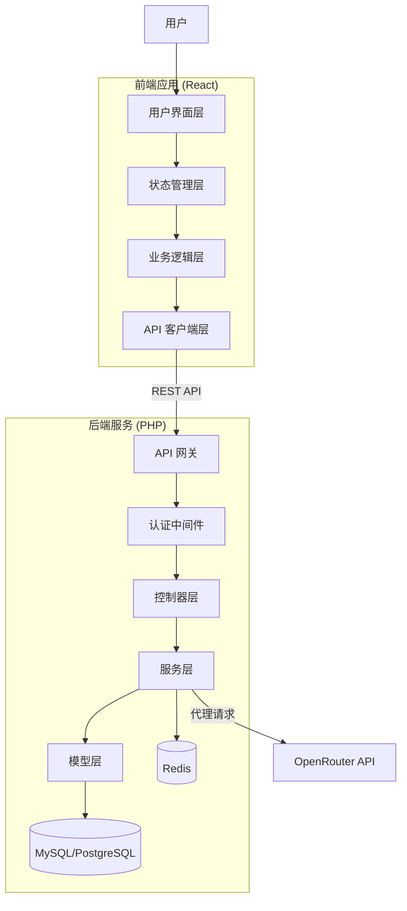
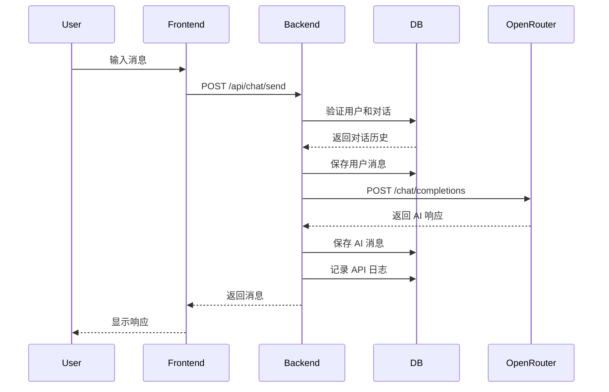
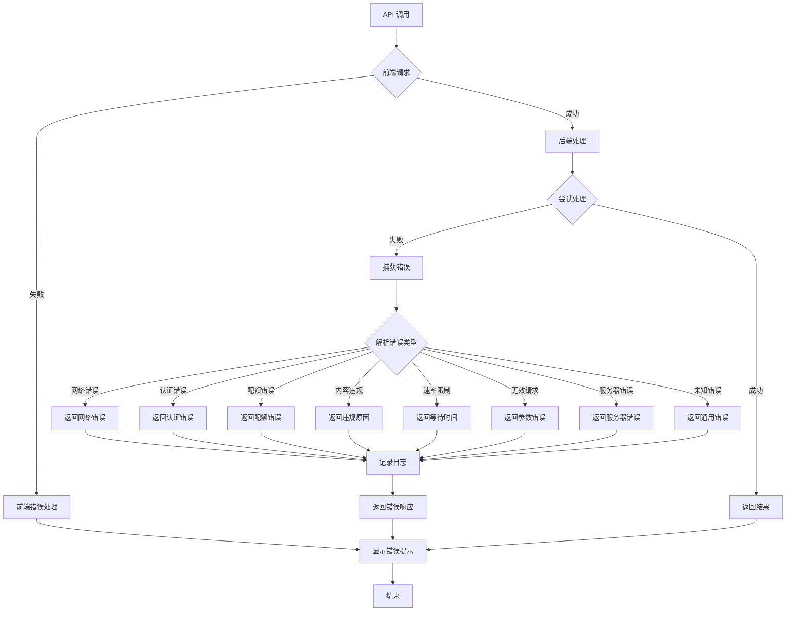

# Design Document: OpenRouter AI Chat System

## Overview

OpenRouter AI Chat System 是一个基于 Web 的 AI 聊天和图片生成应用，通过 OpenRouter API 提供多模型 AI 对话和图片生成功能。

### 核心功能

1. **多模型聊天**: 支持 Grok、Gemini、GPT 三个模型的文本对话
2. **智能联网搜索**: 自动检测需要联网搜索的问题，使用支持搜索的模型（如 Perplexity）获取实时信息
3. **图片生成**: 支持纯文本或文本+图片输入生成新图片
4. **对话管理**: 支持多会话管理、历史记录保存
5. **配置管理**: API 密钥配置和验证

### 技术栈选择

**前端**:
- **框架**: React + TypeScript
- **状态管理**: React Context API + useReducer
- **UI 组件库**: Tailwind CSS + Headless UI
- **HTTP 客户端**: Axios
- **构建工具**: Vite

**后端**:
- **语言**: PHP 8.1+
- **框架**: Slim Framework 4.x（轻量级 REST API 框架）
  - 选择理由：轻量、灵活、专注于 API 开发
  - 备选方案：Laravel（功能更全面但较重）
- **数据库**: MySQL 8.0+ 或 PostgreSQL 14+
- **ORM**: PDO（原生）或 Eloquent（如果使用 Laravel）
- **认证**: JWT (JSON Web Tokens)
- **缓存**: Redis（可选，用于会话和限流）
- **依赖管理**: Composer

**为什么选择 Slim Framework？**
1. **轻量级**: 核心代码简洁，学习曲线平缓
2. **专注 API**: 专为 RESTful API 设计，无多余功能
3. **灵活性**: 可自由选择组件和库
4. **性能**: 比全栈框架更快的响应速度
5. **PSR 标准**: 遵循 PHP-FIG 标准，代码规范

**如果需要更多功能，可考虑 Laravel**:
- 内置完整的认证系统
- 强大的 ORM（Eloquent）
- 任务队列和调度
- 更丰富的生态系统
- 但会增加项目复杂度和资源消耗

### 架构原则

1. **前后端分离**: 清晰的 API 边界，前端通过 REST API 与后端通信
2. **安全优先**: API 密钥存储在后端，前端不直接暴露敏感信息
3. **可扩展性**: 数据库设计支持多用户、配额管理、充值等未来功能
4. **模块化设计**: 清晰的模块边界，便于未来扩展
5. **错误优先**: 完善的错误处理和用户提示
6. **类型安全**: 全面使用 TypeScript 类型系统（前端）

## Architecture

### 系统架构图



### 前端架构

#### React 项目结构

```
frontend/
├── public/
│   ├── index.html
│   └── favicon.ico
├── src/
│   ├── components/            # UI 组件
│   │   ├── chat/
│   │   │   ├── ChatInterface.tsx
│   │   │   ├── MessageList.tsx
│   │   │   ├── MessageInput.tsx
│   │   │   └── ModelSelector.tsx
│   │   ├── image/
│   │   │   ├── ImageGenerator.tsx
│   │   │   ├── ImageUpload.tsx
│   │   │   └── ImagePreview.tsx
│   │   ├── conversation/
│   │   │   ├── ConversationList.tsx
│   │   │   └── ConversationItem.tsx
│   │   ├── settings/
│   │   │   ├── SettingsPanel.tsx
│   │   │   └── ApiKeyConfig.tsx
│   │   └── common/
│   │       ├── Button.tsx
│   │       ├── Input.tsx
│   │       ├── Modal.tsx
│   │       └── ErrorMessage.tsx
│   ├── contexts/              # React Context
│   │   ├── AppContext.tsx
│   │   ├── ChatContext.tsx
│   │   └── AuthContext.tsx
│   ├── services/              # 业务逻辑服务
│   │   ├── ApiClient.ts
│   │   ├── ChatService.ts
│   │   ├── ImageService.ts
│   │   ├── ConversationService.ts
│   │   └── AuthService.ts
│   ├── hooks/                 # 自定义 Hooks
│   │   ├── useChat.ts
│   │   ├── useConversation.ts
│   │   └── useAuth.ts
│   ├── types/                 # TypeScript 类型定义
│   │   ├── api.ts
│   │   ├── chat.ts
│   │   ├── conversation.ts
│   │   └── user.ts
│   ├── utils/                 # 工具函数
│   │   ├── errorHandler.ts
│   │   ├── validator.ts
│   │   └── formatter.ts
│   ├── App.tsx                # 根组件
│   ├── main.tsx               # 应用入口
│   └── index.css              # 全局样式
├── tests/                     # 测试文件
│   ├── unit/
│   ├── integration/
│   └── property/
├── .env.example               # 环境变量示例
├── .env                       # 环境变量（不提交）
├── package.json               # NPM 依赖配置
├── tsconfig.json              # TypeScript 配置
├── vite.config.ts             # Vite 配置
└── README.md
```

#### 前端依赖配置

**package.json 示例**:

```json
{
  "name": "openrouter-chat-frontend",
  "version": "1.0.0",
  "type": "module",
  "scripts": {
    "dev": "vite",
    "build": "tsc && vite build",
    "preview": "vite preview",
    "test": "vitest run",
    "test:watch": "vitest",
    "lint": "eslint . --ext ts,tsx"
  },
  "dependencies": {
    "react": "^18.2.0",
    "react-dom": "^18.2.0",
    "axios": "^1.6.0",
    "react-router-dom": "^6.20.0"
  },
  "devDependencies": {
    "@types/react": "^18.2.0",
    "@types/react-dom": "^18.2.0",
    "@vitejs/plugin-react": "^4.2.0",
    "typescript": "^5.3.0",
    "vite": "^5.0.0",
    "vitest": "^1.0.0",
    "fast-check": "^3.15.0",
    "@testing-library/react": "^14.1.0",
    "@testing-library/jest-dom": "^6.1.0",
    "tailwindcss": "^3.4.0",
    "autoprefixer": "^10.4.0",
    "postcss": "^8.4.0",
    "eslint": "^8.55.0"
  }
}
```

**主要依赖说明**:
- `react` + `react-dom`: React 核心库
- `axios`: HTTP 客户端
- `react-router-dom`: 路由管理
- `vite`: 构建工具
- `vitest`: 测试框架
- `fast-check`: 属性测试库
- `@testing-library/react`: React 组件测试
- `tailwindcss`: CSS 框架

#### 1. 用户界面层 (UI Layer)
- **职责**: 渲染界面、处理用户交互
- **组件**:
  - `ChatInterface`: 聊天界面
  - `ImageGenerator`: 图片生成界面
  - `ModelSelector`: 模型选择器
  - `ConversationList`: 对话列表
  - `SettingsPanel`: 设置面板
  - `LoginForm`: 登录表单（预留）

#### 2. 状态管理层 (State Management Layer)
- **职责**: 管理应用全局状态
- **Context**:
  - `AppContext`: 应用全局状态
  - `ChatContext`: 聊天状态
  - `AuthContext`: 认证状态（预留）

#### 3. 业务逻辑层 (Business Logic Layer)
- **职责**: 实现前端业务逻辑
- **服务**:
  - `ChatService`: 聊天逻辑
  - `ImageService`: 图片生成逻辑
  - `ConversationService`: 对话管理
  - `AuthService`: 认证服务（预留）

#### 4. API 客户端层 (API Client Layer)
- **职责**: 与后端 API 通信
- **客户端**:
  - `ApiClient`: 统一 API 调用封装
  - `RequestInterceptor`: 请求拦截器（添加 token）
  - `ResponseInterceptor`: 响应拦截器（处理错误）

### 后端架构

#### PHP 项目结构

```
backend/
├── public/
│   └── index.php              # 应用入口
├── src/
│   ├── Controllers/           # 控制器层
│   │   ├── ChatController.php
│   │   ├── ImageController.php
│   │   ├── ConversationController.php
│   │   ├── ConfigController.php
│   │   └── AuthController.php
│   ├── Services/              # 服务层
│   │   ├── OpenRouterService.php
│   │   ├── ConversationService.php
│   │   ├── ConfigService.php
│   │   ├── UsageTrackingService.php
│   │   ├── EncryptionService.php
│   │   └── AuthService.php
│   ├── Models/                # 数据模型
│   │   ├── User.php
│   │   ├── Conversation.php
│   │   ├── Message.php
│   │   ├── ApiLog.php
│   │   └── UserConfig.php
│   ├── Middleware/            # 中间件
│   │   ├── AuthMiddleware.php
│   │   ├── CorsMiddleware.php
│   │   └── RateLimitMiddleware.php
│   ├── Exceptions/            # 自定义异常
│   │   ├── OpenRouterException.php
│   │   ├── ValidationException.php
│   │   ├── AuthException.php
│   │   └── RateLimitException.php
│   ├── Utils/                 # 工具类
│   │   ├── Database.php
│   │   ├── ErrorHandler.php
│   │   └── Validator.php
│   └── routes.php             # 路由定义
├── config/
│   ├── database.php           # 数据库配置
│   ├── app.php                # 应用配置
│   └── cors.php               # CORS 配置
├── migrations/                # 数据库迁移
│   ├── 001_create_users_table.sql
│   ├── 002_create_conversations_table.sql
│   ├── 003_create_messages_table.sql
│   ├── 004_create_user_configs_table.sql
│   ├── 005_create_api_logs_table.sql
│   └── 006_create_transactions_table.sql
├── tests/                     # 测试文件
│   ├── Unit/
│   ├── Integration/
│   └── Property/
├── vendor/                    # Composer 依赖
├── .env.example               # 环境变量示例
├── .env                       # 环境变量（不提交）
├── composer.json              # PHP 依赖配置
└── README.md
```

#### Composer 依赖配置

**composer.json 示例**:

```json
{
    "name": "openrouter/chat-system",
    "description": "OpenRouter AI Chat System Backend",
    "type": "project",
    "require": {
        "php": "^8.1",
        "slim/slim": "^4.12",
        "slim/psr7": "^1.6",
        "guzzlehttp/guzzle": "^7.8",
        "firebase/php-jwt": "^6.9",
        "vlucas/phpdotenv": "^5.6",
        "ramsey/uuid": "^4.7",
        "predis/predis": "^2.2"
    },
    "require-dev": {
        "phpunit/phpunit": "^10.5",
        "giorgiosironi/eris": "^0.14"
    },
    "autoload": {
        "psr-4": {
            "App\\": "src/"
        }
    },
    "autoload-dev": {
        "psr-4": {
            "Tests\\": "tests/"
        }
    },
    "scripts": {
        "test": "phpunit",
        "start": "php -S 0.0.0.0:8080 -t public"
    }
}
```

**主要依赖说明**:
- `slim/slim`: Slim Framework 核心
- `slim/psr7`: PSR-7 HTTP 消息实现
- `guzzlehttp/guzzle`: HTTP 客户端（调用 OpenRouter API）
- `firebase/php-jwt`: JWT 认证库
- `vlucas/phpdotenv`: 环境变量管理
- `ramsey/uuid`: UUID 生成
- `predis/predis`: Redis 客户端（可选）
- `phpunit/phpunit`: 单元测试框架
- `giorgiosironi/eris`: 属性测试库

#### 1. API 网关层 (API Gateway)
- **职责**: 路由请求、CORS 处理、请求日志
- **功能**:
  - 路由分发
  - CORS 配置
  - 请求日志记录
  - 速率限制

#### 2. 认证中间件 (Authentication Middleware)
- **职责**: 验证用户身份、会话管理
- **功能**:
  - JWT token 验证
  - 会话管理
  - 权限检查（预留）

**AuthMiddleware 实现示例**:

```php
<?php

namespace App\Middleware;

use Psr\Http\Message\ServerRequestInterface as Request;
use Psr\Http\Server\RequestHandlerInterface as RequestHandler;
use Psr\Http\Message\ResponseInterface as Response;
use Firebase\JWT\JWT;
use Firebase\JWT\Key;

class AuthMiddleware {
    private string $secretKey;
    
    public function __construct(string $secretKey) {
        $this->secretKey = $secretKey;
    }
    
    public function __invoke(Request $request, RequestHandler $handler): Response {
        // 获取 Authorization header
        $authHeader = $request->getHeaderLine('Authorization');
        
        if (empty($authHeader)) {
            return $this->unauthorizedResponse('Missing authorization header');
        }
        
        // 提取 token
        if (!preg_match('/Bearer\s+(.*)$/i', $authHeader, $matches)) {
            return $this->unauthorizedResponse('Invalid authorization format');
        }
        
        $token = $matches[1];
        
        try {
            // 验证 JWT token
            $decoded = JWT::decode($token, new Key($this->secretKey, 'HS256'));
            
            // 将用户信息添加到请求属性
            $request = $request->withAttribute('userId', $decoded->userId);
            $request = $request->withAttribute('user', $decoded);
            
            // 继续处理请求
            return $handler->handle($request);
            
        } catch (\Exception $e) {
            return $this->unauthorizedResponse('Invalid or expired token');
        }
    }
    
    private function unauthorizedResponse(string $message): Response {
        $response = new \Slim\Psr7\Response();
        $response->getBody()->write(json_encode([
            'success' => false,
            'error' => [
                'code' => 'AUTH_ERROR',
                'message' => $message,
            ],
        ]));
        
        return $response
            ->withStatus(401)
            ->withHeader('Content-Type', 'application/json');
    }
}
```

**CorsMiddleware 实现示例**:

```php
<?php

namespace App\Middleware;

use Psr\Http\Message\ServerRequestInterface as Request;
use Psr\Http\Server\RequestHandlerInterface as RequestHandler;
use Psr\Http\Message\ResponseInterface as Response;

class CorsMiddleware {
    private array $allowedOrigins;
    
    public function __construct(array $allowedOrigins) {
        $this->allowedOrigins = $allowedOrigins;
    }
    
    public function __invoke(Request $request, RequestHandler $handler): Response {
        $response = $handler->handle($request);
        
        $origin = $request->getHeaderLine('Origin');
        
        // 检查来源是否允许
        if (in_array($origin, $this->allowedOrigins) || in_array('*', $this->allowedOrigins)) {
            $response = $response
                ->withHeader('Access-Control-Allow-Origin', $origin)
                ->withHeader('Access-Control-Allow-Headers', 'Content-Type, Authorization')
                ->withHeader('Access-Control-Allow-Methods', 'GET, POST, PUT, DELETE, OPTIONS')
                ->withHeader('Access-Control-Allow-Credentials', 'true');
        }
        
        return $response;
    }
}
```

**RateLimitMiddleware 实现示例**:

```php
<?php

namespace App\Middleware;

use Psr\Http\Message\ServerRequestInterface as Request;
use Psr\Http\Server\RequestHandlerInterface as RequestHandler;
use Psr\Http\Message\ResponseInterface as Response;

class RateLimitMiddleware {
    private \Redis $redis;
    private int $maxRequests;
    private int $windowSeconds;
    
    public function __construct(\Redis $redis, int $maxRequests = 100, int $windowSeconds = 60) {
        $this->redis = $redis;
        $this->maxRequests = $maxRequests;
        $this->windowSeconds = $windowSeconds;
    }
    
    public function __invoke(Request $request, RequestHandler $handler): Response {
        // 获取用户标识（IP 或用户 ID）
        $userId = $request->getAttribute('userId');
        $identifier = $userId ?? $this->getClientIp($request);
        
        $key = "rate_limit:{$identifier}";
        $current = $this->redis->incr($key);
        
        if ($current === 1) {
            $this->redis->expire($key, $this->windowSeconds);
        }
        
        if ($current > $this->maxRequests) {
            $response = new \Slim\Psr7\Response();
            $response->getBody()->write(json_encode([
                'success' => false,
                'error' => [
                    'code' => 'RATE_LIMIT',
                    'message' => "请求过于频繁，请等待 {$this->windowSeconds} 秒后重试",
                    'details' => ['retryAfter' => $this->windowSeconds],
                ],
            ]));
            
            return $response
                ->withStatus(429)
                ->withHeader('Content-Type', 'application/json')
                ->withHeader('Retry-After', (string)$this->windowSeconds);
        }
        
        return $handler->handle($request);
    }
    
    private function getClientIp(Request $request): string {
        $serverParams = $request->getServerParams();
        return $serverParams['REMOTE_ADDR'] ?? 'unknown';
    }
}
```

#### 3. 控制器层 (Controllers)
- **职责**: 处理 HTTP 请求和响应
- **控制器**:
  - `ChatController`: 聊天相关接口
  - `ImageController`: 图片生成接口
  - `ConversationController`: 对话管理接口
  - `ConfigController`: 配置管理接口
  - `AuthController`: 认证接口（预留）
  - `UserController`: 用户管理接口（预留）

#### 4. 服务层 (Services)
- **职责**: 核心业务逻辑
- **服务**:
  - `OpenRouterService`: OpenRouter API 代理
  - `ConversationService`: 对话业务逻辑
  - `ConfigService`: 配置管理
  - `UsageTrackingService`: API 使用追踪
  - `AuthService`: 认证服务（预留）
  - `PaymentService`: 支付服务（预留）

#### 5. 模型层 (Models)
- **职责**: 数据库操作和数据模型
- **模型**:
  - `User`: 用户模型
  - `Conversation`: 对话模型
  - `Message`: 消息模型
  - `ApiLog`: API 日志模型
  - `UserConfig`: 用户配置模型
  - `Transaction`: 交易记录（预留）

#### 6. 数据库层 (Database)
- **职责**: 数据持久化
- **数据库**: MySQL 8.0+ 或 PostgreSQL 14+
- **缓存**: Redis（可选，用于会话和限流）

## Components and Interfaces

### 前端组件

#### 1. ApiClient

统一的后端 API 客户端。

```typescript
interface ApiClientConfig {
  baseURL: string;
  timeout?: number;
}

interface ApiResponse<T> {
  success: boolean;
  data?: T;
  error?: {
    code: string;
    message: string;
    details?: any;
  };
}

class ApiClient {
  constructor(config: ApiClientConfig);
  
  // 认证相关（预留）
  async login(credentials: LoginCredentials): Promise<ApiResponse<AuthToken>>;
  async logout(): Promise<ApiResponse<void>>;
  
  // 聊天相关
  async sendMessage(request: ChatRequest): Promise<ApiResponse<Message>>;
  async retryMessage(conversationId: string, messageId: string): Promise<ApiResponse<Message>>;
  
  // 图片生成
  async generateImage(request: ImageGenerationRequest): Promise<ApiResponse<GeneratedImage>>;
  
  // 对话管理
  async getConversations(): Promise<ApiResponse<Conversation[]>>;
  async getConversation(id: string): Promise<ApiResponse<Conversation>>;
  async createConversation(model: ModelType): Promise<ApiResponse<Conversation>>;
  async deleteConversation(id: string): Promise<ApiResponse<void>>;
  
  // 配置管理
  async getConfig(): Promise<ApiResponse<UserConfig>>;
  async updateConfig(config: Partial<UserConfig>): Promise<ApiResponse<UserConfig>>;
  
  // 内部方法
  private setAuthToken(token: string): void;
  private handleError(error: any): ApiResponse<never>;
}
```

#### 2. ChatService (前端)

前端聊天业务逻辑服务。

```typescript
interface Message {
  id: string;
  conversationId: string;
  role: 'user' | 'assistant' | 'system';
  content: string;
  timestamp: number;
  model?: string;
  sources?: SearchSource[];
}

interface SearchSource {
  title: string;
  url: string;
  snippet?: string;
}

interface ChatOptions {
  model: ModelType;
  conversationId: string;
  enableSearch?: boolean;
}

class ChatService {
  constructor(private apiClient: ApiClient);
  
  async sendMessage(
    content: string,
    options: ChatOptions
  ): Promise<Message>;
  
  async retryLastMessage(
    conversationId: string,
    messageId: string
  ): Promise<Message>;
  
  private shouldUseSearchModel(content: string): boolean;
}
```

#### 3. ImageService (前端)

前端图片生成业务逻辑服务。

```typescript
interface ImageGenerationOptions {
  prompt: string;
  sourceImage?: File;
}

interface GeneratedImage {
  id: string;
  url: string;
  prompt: string;
  timestamp: number;
}

class ImageService {
  constructor(private apiClient: ApiClient);
  
  async generateImage(
    options: ImageGenerationOptions
  ): Promise<GeneratedImage>;
  
  async downloadImage(imageUrl: string, filename: string): Promise<void>;
  
  validateImageFile(file: File): ValidationResult;
}
```

#### 4. ConversationService (前端)

前端对话会话管理服务。

```typescript
interface Conversation {
  id: string;
  title: string;
  messages: Message[];
  createdAt: number;
  updatedAt: number;
  model: ModelType;
  userId: string;
}

class ConversationService {
  constructor(private apiClient: ApiClient);
  
  async createConversation(model: ModelType): Promise<Conversation>;
  async getConversation(id: string): Promise<Conversation>;
  async listConversations(): Promise<Conversation[]>;
  async deleteConversation(id: string): Promise<void>;
}
```

### 后端 API 接口

#### API 路由设计

所有 API 路由以 `/api` 为前缀，遵循 RESTful 设计原则。

**路由文件示例 (src/routes.php)**:

```php
<?php

use Slim\App;
use Psr\Http\Message\ResponseInterface as Response;
use Psr\Http\Message\ServerRequestInterface as Request;

return function (App $app) {
    // CORS 中间件（应用到所有路由）
    $app->add(new \App\Middleware\CorsMiddleware());
    
    // 公开路由（不需要认证）
    $app->group('/api', function ($group) {
        // 健康检查
        $group->get('/health', function (Request $request, Response $response) {
            $response->getBody()->write(json_encode(['status' => 'ok']));
            return $response->withHeader('Content-Type', 'application/json');
        });
        
        // 认证路由（预留）
        $group->post('/auth/register', '\App\Controllers\AuthController:register');
        $group->post('/auth/login', '\App\Controllers\AuthController:login');
    });
    
    // 受保护路由（需要认证）
    $app->group('/api', function ($group) {
        // 聊天接口
        $group->post('/chat/send', '\App\Controllers\ChatController:send');
        $group->post('/chat/retry', '\App\Controllers\ChatController:retry');
        
        // 图片生成接口
        $group->post('/image/generate', '\App\Controllers\ImageController:generate');
        
        // 对话管理接口
        $group->get('/conversations', '\App\Controllers\ConversationController:list');
        $group->get('/conversations/{id}', '\App\Controllers\ConversationController:get');
        $group->post('/conversations', '\App\Controllers\ConversationController:create');
        $group->delete('/conversations/{id}', '\App\Controllers\ConversationController:delete');
        
        // 配置管理接口
        $group->get('/config', '\App\Controllers\ConfigController:get');
        $group->put('/config', '\App\Controllers\ConfigController:update');
        $group->post('/config/api-key', '\App\Controllers\ConfigController:saveApiKey');
        
        // 用户管理接口（预留）
        $group->get('/users/me', '\App\Controllers\UserController:me');
        $group->post('/users/me/recharge', '\App\Controllers\UserController:recharge');
        $group->get('/users/me/usage', '\App\Controllers\UserController:usage');
        $group->get('/users/me/transactions', '\App\Controllers\UserController:transactions');
        
        // 认证相关
        $group->post('/auth/logout', '\App\Controllers\AuthController:logout');
        $group->post('/auth/refresh', '\App\Controllers\AuthController:refresh');
        $group->get('/auth/me', '\App\Controllers\AuthController:me');
    })->add(new \App\Middleware\AuthMiddleware());
    
    // 速率限制中间件（可选）
    // $app->add(new \App\Middleware\RateLimitMiddleware());
};
```

#### 1. 认证接口（预留）

```
POST /api/auth/register
POST /api/auth/login
POST /api/auth/logout
POST /api/auth/refresh
GET  /api/auth/me
```

#### 2. 聊天接口

```
POST /api/chat/send
  Body: {
    conversationId: string,
    content: string,
    model: string,
    enableSearch?: boolean
  }
  Response: {
    success: boolean,
    data: {
      id: string,
      conversationId: string,
      role: string,
      content: string,
      timestamp: number,
      model: string,
      sources?: SearchSource[]
    }
  }

POST /api/chat/retry
  Body: {
    conversationId: string,
    messageId: string
  }
  Response: { success: boolean, data: Message }
```

#### 3. 图片生成接口

```
POST /api/image/generate
  Body: FormData {
    prompt: string,
    sourceImage?: File
  }
  Response: {
    success: boolean,
    data: {
      id: string,
      url: string,
      prompt: string,
      timestamp: number
    }
  }
```

#### 4. 对话管理接口

```
GET    /api/conversations
  Response: { success: boolean, data: Conversation[] }

GET    /api/conversations/:id
  Response: { success: boolean, data: Conversation }

POST   /api/conversations
  Body: { model: string }
  Response: { success: boolean, data: Conversation }

DELETE /api/conversations/:id
  Response: { success: boolean }
```

#### 5. 配置管理接口

```
GET  /api/config
  Response: {
    success: boolean,
    data: {
      defaultModel: string,
      theme?: string,
      preferences?: object
    }
  }

PUT  /api/config
  Body: { defaultModel?: string, theme?: string, preferences?: object }
  Response: { success: boolean, data: UserConfig }

POST /api/config/api-key
  Body: { apiKey: string }
  Response: { success: boolean }
```

#### 6. 用户管理接口（预留）

```
GET    /api/users/me
POST   /api/users/me/recharge
GET    /api/users/me/usage
GET    /api/users/me/transactions
```

### 后端服务组件

#### 1. OpenRouterService (PHP)

OpenRouter API 代理服务。

```php
<?php

class OpenRouterService {
    private string $apiKey;
    private string $baseUrl = 'https://openrouter.ai/api/v1';
    
    public function __construct(string $apiKey) {
        $this->apiKey = $apiKey;
    }
    
    public function chat(array $request): array {
        // 代理聊天请求到 OpenRouter
        // 返回: ['id' => string, 'model' => string, 'choices' => array, 'usage' => array]
    }
    
    public function generateImage(array $request): array {
        // 代理图片生成请求到 OpenRouter
        // 返回: ['id' => string, 'imageUrl' => string, 'revisedPrompt' => string]
    }
    
    public function validateApiKey(): bool {
        // 验证 API 密钥是否有效
    }
    
    private function makeRequest(string $endpoint, array $data): array {
        // 发送 HTTP 请求
    }
    
    private function handleError(\Exception $e): never {
        // 错误处理
    }
}
```

#### 2. ConversationService (PHP)

对话管理服务。

```php
<?php

class ConversationService {
    private PDO $db;
    
    public function __construct(PDO $db) {
        $this->db = $db;
    }
    
    public function create(int $userId, string $model): array {
        // 创建新对话
        // 返回: Conversation
    }
    
    public function get(int $userId, string $conversationId): ?array {
        // 获取对话（包含消息）
        // 返回: Conversation | null
    }
    
    public function list(int $userId): array {
        // 列出用户的所有对话
        // 返回: Conversation[]
    }
    
    public function delete(int $userId, string $conversationId): bool {
        // 删除对话
    }
    
    public function addMessage(string $conversationId, array $message): void {
        // 添加消息到对话
    }
    
    private function generateTitle(string $firstMessage): string {
        // 生成对话标题
    }
}
```

#### 3. UsageTrackingService (PHP)

API 使用追踪服务。

```php
<?php

class UsageTrackingService {
    private PDO $db;
    
    public function __construct(PDO $db) {
        $this->db = $db;
    }
    
    public function logApiCall(array $logData): void {
        // 记录 API 调用日志
        // $logData: ['userId', 'endpoint', 'method', 'statusCode', 'tokensUsed', 'cost']
    }
    
    public function getUserUsage(int $userId, array $period): array {
        // 获取用户使用统计
        // 返回: ['totalTokens', 'totalCost', 'requestCount']
    }
    
    public function checkQuota(int $userId): bool {
        // 检查用户配额（预留）
    }
}
```

#### 4. ConfigService (PHP)

配置管理服务。

```php
<?php

class ConfigService {
    private PDO $db;
    
    public function __construct(PDO $db) {
        $this->db = $db;
    }
    
    public function getConfig(int $userId): ?array {
        // 获取用户配置
        // 返回: UserConfig | null
    }
    
    public function saveConfig(int $userId, array $config): void {
        // 保存用户配置
    }
    
    public function saveApiKey(int $userId, string $apiKey): void {
        // 保存加密的 API 密钥
    }
    
    public function getApiKey(int $userId): ?string {
        // 获取解密的 API 密钥
    }
    
    private function encryptApiKey(string $apiKey): string {
        // 加密 API 密钥
    }
    
    private function decryptApiKey(string $encrypted): string {
        // 解密 API 密钥
    }
}
```

### 类型定义

```typescript
type ModelType = 'grok' | 'gemini' | 'gpt' | 'perplexity';

// 模型配置映射
const MODEL_CONFIG: Record<ModelType, { id: string; supportsSearch: boolean }> = {
  grok: { id: 'x-ai/grok-beta', supportsSearch: false },
  gemini: { id: 'google/gemini-pro', supportsSearch: false },
  gpt: { id: 'openai/gpt-4-turbo', supportsSearch: false },
  perplexity: { id: 'perplexity/llama-3.1-sonar-large-128k-online', supportsSearch: true },
};

interface ValidationResult {
  valid: boolean;
  error?: string;
}

interface ApiError {
  code: string;
  message: string;
  details?: any;
}

// 错误代码枚举
enum ErrorCode {
  NETWORK_ERROR = 'NETWORK_ERROR',
  AUTH_ERROR = 'AUTH_ERROR',
  QUOTA_EXCEEDED = 'QUOTA_EXCEEDED',
  CONTENT_POLICY_VIOLATION = 'CONTENT_POLICY_VIOLATION',
  RATE_LIMIT = 'RATE_LIMIT',
  INVALID_REQUEST = 'INVALID_REQUEST',
  UNKNOWN_ERROR = 'UNKNOWN_ERROR',
}

// 认证相关（预留）
interface LoginCredentials {
  email: string;
  password: string;
}

interface AuthToken {
  token: string;
  expiresAt: number;
}

interface UserConfig {
  defaultModel: ModelType;
  theme?: 'light' | 'dark';
  preferences?: {
    language?: string;
    notifications?: boolean;
  };
}
```

## Data Models

### 数据库 Schema (MySQL/PostgreSQL)

#### 数据库迁移管理

使用 SQL 迁移脚本管理数据库版本，按顺序执行：

**迁移脚本命名规范**: `{序号}_{描述}.sql`

**迁移执行顺序**:
1. `001_create_users_table.sql`
2. `002_create_conversations_table.sql`
3. `003_create_messages_table.sql`
4. `004_create_user_configs_table.sql`
5. `005_create_api_logs_table.sql`
6. `006_create_transactions_table.sql`

**迁移管理工具**（可选）:
- Phinx（PHP 数据库迁移工具）
- Laravel Migrations（如果使用 Laravel）
- 手动执行 SQL 脚本

**回滚策略**:
- 每个迁移脚本应有对应的回滚脚本
- 命名格式: `{序号}_{描述}_rollback.sql`
- 在生产环境执行迁移前先在测试环境验证

#### Users Table

```sql
CREATE TABLE users (
  id INT AUTO_INCREMENT PRIMARY KEY,
  email VARCHAR(255) UNIQUE NOT NULL,
  password_hash VARCHAR(255) NOT NULL,
  username VARCHAR(100),
  balance DECIMAL(10, 2) DEFAULT 0.00,
  status ENUM('active', 'suspended', 'deleted') DEFAULT 'active',
  created_at TIMESTAMP DEFAULT CURRENT_TIMESTAMP,
  updated_at TIMESTAMP DEFAULT CURRENT_TIMESTAMP ON UPDATE CURRENT_TIMESTAMP,
  last_login_at TIMESTAMP NULL,
  
  INDEX idx_email (email),
  INDEX idx_status (status),
  INDEX idx_created_at (created_at)
);
```

**字段说明**:
- `id`: 用户唯一标识
- `email`: 用户邮箱（用于登录）
- `password_hash`: 密码哈希（bcrypt）
- `username`: 用户名（可选）
- `balance`: 账户余额（预留，用于充值功能）
- `status`: 用户状态
- `created_at`: 创建时间
- `updated_at`: 更新时间
- `last_login_at`: 最后登录时间

#### Conversations Table

```sql
CREATE TABLE conversations (
  id CHAR(36) PRIMARY KEY,  -- UUID
  user_id INT NOT NULL,
  title VARCHAR(255) NOT NULL,
  model VARCHAR(50) NOT NULL,
  has_search_results BOOLEAN DEFAULT FALSE,
  created_at TIMESTAMP DEFAULT CURRENT_TIMESTAMP,
  updated_at TIMESTAMP DEFAULT CURRENT_TIMESTAMP ON UPDATE CURRENT_TIMESTAMP,
  deleted_at TIMESTAMP NULL,
  
  FOREIGN KEY (user_id) REFERENCES users(id) ON DELETE CASCADE,
  INDEX idx_user_id (user_id),
  INDEX idx_created_at (created_at),
  INDEX idx_deleted_at (deleted_at)
);
```

**字段说明**:
- `id`: 对话唯一标识（UUID）
- `user_id`: 所属用户 ID
- `title`: 对话标题
- `model`: 使用的模型
- `has_search_results`: 是否包含搜索结果
- `created_at`: 创建时间
- `updated_at`: 更新时间
- `deleted_at`: 软删除时间（NULL 表示未删除）

#### Messages Table

```sql
CREATE TABLE messages (
  id CHAR(36) PRIMARY KEY,  -- UUID
  conversation_id CHAR(36) NOT NULL,
  role ENUM('user', 'assistant', 'system') NOT NULL,
  content TEXT NOT NULL,
  model VARCHAR(50),
  sources JSON,  -- 搜索来源（JSON 格式）
  created_at TIMESTAMP DEFAULT CURRENT_TIMESTAMP,
  
  FOREIGN KEY (conversation_id) REFERENCES conversations(id) ON DELETE CASCADE,
  INDEX idx_conversation_id (conversation_id),
  INDEX idx_created_at (created_at)
);
```

**字段说明**:
- `id`: 消息唯一标识（UUID）
- `conversation_id`: 所属对话 ID
- `role`: 消息角色
- `content`: 消息内容
- `model`: 使用的模型（仅 assistant 消息）
- `sources`: 搜索来源（JSON 数组，格式: `[{"title": "...", "url": "...", "snippet": "..."}]`）
- `created_at`: 创建时间

#### User_Configs Table

```sql
CREATE TABLE user_configs (
  id INT AUTO_INCREMENT PRIMARY KEY,
  user_id INT UNIQUE NOT NULL,
  api_key_encrypted TEXT,  -- 加密的 OpenRouter API 密钥
  default_model VARCHAR(50) DEFAULT 'gpt',
  theme VARCHAR(20) DEFAULT 'light',
  preferences JSON,  -- 其他偏好设置（JSON 格式）
  created_at TIMESTAMP DEFAULT CURRENT_TIMESTAMP,
  updated_at TIMESTAMP DEFAULT CURRENT_TIMESTAMP ON UPDATE CURRENT_TIMESTAMP,
  
  FOREIGN KEY (user_id) REFERENCES users(id) ON DELETE CASCADE,
  INDEX idx_user_id (user_id)
);
```

**字段说明**:
- `id`: 配置唯一标识
- `user_id`: 所属用户 ID
- `api_key_encrypted`: 加密的 API 密钥（使用 AES-256-CBC）
- `default_model`: 默认模型
- `theme`: 主题设置
- `preferences`: 其他偏好设置（JSON 对象）
- `created_at`: 创建时间
- `updated_at`: 更新时间

#### Api_Logs Table

```sql
CREATE TABLE api_logs (
  id CHAR(36) PRIMARY KEY,  -- UUID
  user_id INT NOT NULL,
  endpoint VARCHAR(255) NOT NULL,
  method VARCHAR(10) NOT NULL,
  request_time TIMESTAMP NOT NULL,
  response_time TIMESTAMP NOT NULL,
  status_code INT NOT NULL,
  tokens_used INT,
  cost DECIMAL(10, 6),  -- API 调用成本
  error_message TEXT,
  created_at TIMESTAMP DEFAULT CURRENT_TIMESTAMP,
  
  FOREIGN KEY (user_id) REFERENCES users(id) ON DELETE CASCADE,
  INDEX idx_user_id (user_id),
  INDEX idx_request_time (request_time),
  INDEX idx_status_code (status_code)
);
```

**字段说明**:
- `id`: 日志唯一标识（UUID）
- `user_id`: 用户 ID
- `endpoint`: API 端点
- `method`: HTTP 方法
- `request_time`: 请求时间
- `response_time`: 响应时间
- `status_code`: HTTP 状态码
- `tokens_used`: 使用的 token 数量
- `cost`: API 调用成本
- `error_message`: 错误信息（如果有）
- `created_at`: 创建时间

#### Transactions Table（预留）

```sql
CREATE TABLE transactions (
  id CHAR(36) PRIMARY KEY,  -- UUID
  user_id INT NOT NULL,
  type ENUM('recharge', 'consumption', 'refund') NOT NULL,
  amount DECIMAL(10, 2) NOT NULL,
  balance_after DECIMAL(10, 2) NOT NULL,
  description VARCHAR(255),
  payment_method VARCHAR(50),  -- 支付方式（支付宝、微信等）
  payment_id VARCHAR(255),  -- 第三方支付 ID
  status ENUM('pending', 'completed', 'failed', 'refunded') DEFAULT 'pending',
  created_at TIMESTAMP DEFAULT CURRENT_TIMESTAMP,
  completed_at TIMESTAMP NULL,
  
  FOREIGN KEY (user_id) REFERENCES users(id) ON DELETE CASCADE,
  INDEX idx_user_id (user_id),
  INDEX idx_type (type),
  INDEX idx_status (status),
  INDEX idx_created_at (created_at)
);
```

**字段说明**:
- `id`: 交易唯一标识（UUID）
- `user_id`: 用户 ID
- `type`: 交易类型
- `amount`: 交易金额
- `balance_after`: 交易后余额
- `description`: 交易描述
- `payment_method`: 支付方式
- `payment_id`: 第三方支付 ID
- `status`: 交易状态
- `created_at`: 创建时间
- `completed_at`: 完成时间

### PHP 数据模型

#### User Model

```php
<?php

class User {
    public int $id;
    public string $email;
    public ?string $username;
    public float $balance;
    public string $status;
    public string $createdAt;
    public string $updatedAt;
    public ?string $lastLoginAt;
    
    public static function findById(PDO $db, int $id): ?self;
    public static function findByEmail(PDO $db, string $email): ?self;
    public function save(PDO $db): void;
    public function verifyPassword(string $password): bool;
    public function updateBalance(PDO $db, float $amount): void;
}
```

#### Conversation Model

```php
<?php

class Conversation {
    public string $id;
    public int $userId;
    public string $title;
    public string $model;
    public bool $hasSearchResults;
    public string $createdAt;
    public string $updatedAt;
    public ?string $deletedAt;
    public array $messages = [];  // Message[]
    
    public static function findById(PDO $db, string $id): ?self;
    public static function findByUserId(PDO $db, int $userId): array;
    public function save(PDO $db): void;
    public function delete(PDO $db): void;  // 软删除
    public function loadMessages(PDO $db): void;
}
```

#### Message Model

```php
<?php

class Message {
    public string $id;
    public string $conversationId;
    public string $role;
    public string $content;
    public ?string $model;
    public ?array $sources;
    public string $createdAt;
    
    public static function findByConversationId(PDO $db, string $conversationId): array;
    public function save(PDO $db): void;
}
```

### 数据流图



### 数据安全

#### API 密钥加密

后端使用 AES-256-CBC 加密存储用户的 OpenRouter API 密钥：

```php
<?php

class EncryptionService {
    private string $key;
    private string $cipher = 'AES-256-CBC';
    
    public function __construct(string $key) {
        $this->key = $key;
    }
    
    public function encrypt(string $data): string {
        $iv = openssl_random_pseudo_bytes(openssl_cipher_iv_length($this->cipher));
        $encrypted = openssl_encrypt($data, $this->cipher, $this->key, 0, $iv);
        return base64_encode($encrypted . '::' . $iv);
    }
    
    public function decrypt(string $data): string {
        list($encrypted, $iv) = explode('::', base64_decode($data), 2);
        return openssl_decrypt($encrypted, $this->cipher, $this->key, 0, $iv);
    }
}
```

#### 密码哈希

用户密码使用 bcrypt 哈希：

```php
<?php

// 注册时
$passwordHash = password_hash($password, PASSWORD_BCRYPT, ['cost' => 12]);

// 登录验证时
if (password_verify($password, $user->passwordHash)) {
    // 密码正确
}
```

### 数据扩展性设计

数据库设计已考虑未来扩展：

1. **用户系统**: 完整的用户表，支持认证和授权
2. **余额和交易**: 支持充值、消费、退款等功能
3. **配额管理**: 通过 `api_logs` 表追踪使用量
4. **软删除**: 对话支持软删除，便于数据恢复
5. **JSON 字段**: 使用 JSON 存储灵活的扩展数据
6. **索引优化**: 为常用查询添加索引

### 数据迁移策略

当需要添加新功能时：

1. **添加新表**: 使用数据库迁移工具（如 Phinx）
2. **修改现有表**: 使用 ALTER TABLE 语句
3. **数据转换**: 编写迁移脚本处理现有数据
4. **向后兼容**: 保持 API 接口向后兼容


## Correctness Properties

*属性（Property）是一个特征或行为，应该在系统的所有有效执行中保持为真——本质上是关于系统应该做什么的形式化陈述。属性作为人类可读规范和机器可验证正确性保证之间的桥梁。*

### Property 1: 模型选择持久化

*对于任意*选择的模型，保存后再次获取应该返回相同的模型选择。

**Validates: Requirements 1.2, 1.3**

### Property 2: 模型切换保持历史不变

*对于任意*对话历史和任意模型切换操作，切换前后的对话历史应该完全相同。

**Validates: Requirements 1.4**

### Property 3: 模型选择不影响图片生成

*对于任意*模型选择状态，图片生成请求不应该包含或使用该模型参数。

**Validates: Requirements 1.5**

### Property 4: 消息路由到正确模型

*对于任意*文本消息和选定的模型，发送的 API 请求应该指向该模型的端点。

**Validates: Requirements 2.1**

### Property 5: 对话历史完整性

*对于任意*消息序列，添加到对话后检索应该返回所有消息且顺序不变。

**Validates: Requirements 2.3**

### Property 6: API 失败返回错误信息

*对于任意*模拟的 API 失败场景，系统应该返回非空的错误信息。

**Validates: Requirements 2.4**

### Property 7: 多轮对话包含上下文

*对于任意*多轮对话，第 N 条消息的 API 请求应该包含前 N-1 条消息作为上下文。

**Validates: Requirements 2.5**

### Property 8: 文本描述触发图片生成

*对于任意*非空文本描述，调用图片生成应该产生 API 请求。

**Validates: Requirements 3.1**

### Property 9: 图片下载为 PNG 格式

*对于任意*生成的图片，下载操作应该产生 MIME 类型为 image/png 的文件。

**Validates: Requirements 3.5, 4.6**

### Property 10: 图片生成失败显示错误

*对于任意*模拟的图片生成失败，系统应该返回包含错误原因的信息。

**Validates: Requirements 3.6**

### Property 11: 图片和文本组合发送

*对于任意*图片文件和文本描述，API 请求应该同时包含图片数据和文本内容。

**Validates: Requirements 4.2**

### Property 12: 不支持格式返回错误

*对于任意*不在支持列表中的图片格式，上传应该被拒绝并返回格式错误信息。

**Validates: Requirements 4.7**

### Property 13: API 请求包含密钥

*对于任意*配置的 API 密钥，所有 API 请求的 headers 应该包含该密钥。

**Validates: Requirements 5.1**

### Property 14: API 调用产生日志

*对于任意*API 调用（成功或失败），应该产生包含请求时间和响应状态的日志记录。

**Validates: Requirements 5.5**

### Property 15: 会话数据往返一致性

*对于任意*对话会话，保存到存储后再加载应该得到等价的会话对象（包含所有消息和元数据）。

**Validates: Requirements 6.1**

### Property 16: 创建会话增加列表长度

*对于任意*初始会话列表，创建新会话后列表长度应该增加 1。

**Validates: Requirements 6.2**

### Property 17: 删除会话后不可检索

*对于任意*存在的会话 ID，删除后尝试获取该会话应该返回 null 或抛出未找到错误。

**Validates: Requirements 6.3**

### Property 18: 会话切换加载正确历史

*对于任意*两个不同的会话 A 和 B，切换到会话 A 应该加载 A 的历史，切换到 B 应该加载 B 的历史，且两者不相同。

**Validates: Requirements 6.4**

### Property 19: 会话元数据包含必要字段

*对于任意*会话，其元数据应该包含非空的创建时间和正确的消息数量。

**Validates: Requirements 6.5**

### Property 20: API 密钥不明文显示

*对于任意*保存的 API 密钥，从存储中读取用于显示的值应该被遮蔽（如显示为 "sk-***..."）。

**Validates: Requirements 7.2**

### Property 21: 保存配置触发验证

*对于任意*配置保存操作，应该调用 API 密钥验证方法。

**Validates: Requirements 7.3**

### Property 22: 配置更新往返一致性

*对于任意*配置对象，保存后再读取应该得到相同的配置值。

**Validates: Requirements 7.4**

### Property 23: 错误消息为中文

*对于任意*系统错误，返回的错误消息应该包含中文字符且不包含原始技术错误堆栈。

**Validates: Requirements 8.4**

### Property 24: 未知错误记录日志

*对于任意*未预期的错误，应该产生包含错误详情的日志记录。

**Validates: Requirements 8.5**

### Property 25: 搜索模型返回来源链接

*对于任意*使用搜索模型（如 Perplexity）的回复，如果包含引用信息，应该提取并保存搜索来源链接。

**Validates: Requirements 9.1** (联网搜索功能)

### Property 26: 搜索检测触发正确模型

*对于任意*被检测为需要搜索的问题，系统应该使用支持搜索的模型（如 Perplexity）而不是用户选择的普通模型。

**Validates: Requirements 9.2** (联网搜索功能)

## Error Handling

### 错误分类

系统将错误分为以下类别，每类有对应的处理策略：

#### 1. 网络错误 (NETWORK_ERROR)
- **触发条件**: 前端无法连接到后端，或后端无法连接到 OpenRouter API
- **用户提示**: "网络连接失败，请检查网络设置"
- **处理策略**: 
  - 显示重试按钮
  - 记录错误日志
  - 不保存失败的消息到数据库

#### 2. 认证错误 (AUTH_ERROR)
- **触发条件**: JWT token 无效或过期，或 OpenRouter API 密钥无效
- **用户提示**: 
  - Token 错误: "登录已过期，请重新登录"
  - API 密钥错误: "OpenRouter API 密钥无效，请检查配置"
- **处理策略**:
  - Token 错误: 清除本地 token，跳转到登录页
  - API 密钥错误: 引导用户到设置页面
  - 记录认证失败日志

#### 3. 配额超限 (QUOTA_EXCEEDED)
- **触发条件**: OpenRouter API 调用配额用尽，或用户余额不足（预留）
- **用户提示**: 
  - API 配额: "OpenRouter API 配额已用完，请充值或稍后再试"
  - 用户余额: "账户余额不足，请充值"（预留）
- **处理策略**:
  - 显示配额信息
  - 禁用发送按钮
  - 记录配额事件

#### 4. 内容政策违规 (CONTENT_POLICY_VIOLATION)
- **触发条件**: 输入内容违反 OpenRouter 内容政策
- **用户提示**: "内容违反使用政策：{具体原因}"
- **处理策略**:
  - 显示具体违规原因
  - 允许用户修改输入
  - 不保存违规内容

#### 5. 速率限制 (RATE_LIMIT)
- **触发条件**: 请求频率超过限制（前端或 OpenRouter）
- **用户提示**: "请求过于频繁，请等待 {N} 秒后重试"
- **处理策略**:
  - 显示倒计时
  - 后端实现速率限制（使用 Redis）
  - 自动重试（可选）

#### 6. 无效请求 (INVALID_REQUEST)
- **触发条件**: 请求参数错误或验证失败
- **用户提示**: "请求参数错误：{具体问题}"
- **处理策略**:
  - 前端验证输入
  - 后端验证请求
  - 记录详细错误
  - 提供修正建议

#### 7. 服务器错误 (SERVER_ERROR)
- **触发条件**: 后端服务器内部错误
- **用户提示**: "服务器错误，请稍后重试"
- **处理策略**:
  - 记录完整错误堆栈
  - 显示通用错误消息
  - 通知管理员（如果是严重错误）

#### 8. 未知错误 (UNKNOWN_ERROR)
- **触发条件**: 其他未分类错误
- **用户提示**: "发生未知错误，请稍后重试"
- **处理策略**:
  - 记录完整错误堆栈
  - 显示通用错误消息
  - 提供反馈渠道

### 错误处理流程



### 前端错误处理实现

```typescript
class ErrorHandler {
  static handle(error: any): ApiError {
    // 网络错误（无法连接到后端）
    if (error.code === 'ECONNREFUSED' || error.code === 'ETIMEDOUT') {
      return {
        code: ErrorCode.NETWORK_ERROR,
        message: '网络连接失败，请检查网络设置',
      };
    }
    
    // 后端返回的错误
    if (error.response?.data?.error) {
      return error.response.data.error;
    }
    
    // HTTP 状态码错误
    if (error.response) {
      const status = error.response.status;
      
      switch (status) {
        case 401:
          return {
            code: ErrorCode.AUTH_ERROR,
            message: '登录已过期，请重新登录',
          };
          
        case 403:
          return {
            code: ErrorCode.AUTH_ERROR,
            message: '没有权限执行此操作',
          };
          
        case 429:
          const retryAfter = error.response.headers['retry-after'] || 60;
          return {
            code: ErrorCode.RATE_LIMIT,
            message: `请求过于频繁，请等待 ${retryAfter} 秒后重试`,
            details: { retryAfter },
          };
          
        case 500:
        case 502:
        case 503:
          return {
            code: ErrorCode.SERVER_ERROR,
            message: '服务器错误，请稍后重试',
          };
      }
    }
    
    // 未知错误
    console.error('Unknown error:', error);
    return {
      code: ErrorCode.UNKNOWN_ERROR,
      message: '发生未知错误，请稍后重试',
      details: { originalError: error.message },
    };
  }
}
```

### 后端错误处理实现

```php
<?php

class ErrorHandler {
    public static function handle(\Exception $e): array {
        // 记录错误日志
        error_log($e->getMessage() . "\n" . $e->getTraceAsString());
        
        // OpenRouter API 错误
        if ($e instanceof OpenRouterException) {
            return self::handleOpenRouterError($e);
        }
        
        // 验证错误
        if ($e instanceof ValidationException) {
            return [
                'success' => false,
                'error' => [
                    'code' => 'INVALID_REQUEST',
                    'message' => '请求参数错误：' . $e->getMessage(),
                    'details' => $e->getErrors(),
                ],
            ];
        }
        
        // 认证错误
        if ($e instanceof AuthException) {
            http_response_code(401);
            return [
                'success' => false,
                'error' => [
                    'code' => 'AUTH_ERROR',
                    'message' => $e->getMessage(),
                ],
            ];
        }
        
        // 速率限制错误
        if ($e instanceof RateLimitException) {
            http_response_code(429);
            header('Retry-After: ' . $e->getRetryAfter());
            return [
                'success' => false,
                'error' => [
                    'code' => 'RATE_LIMIT',
                    'message' => '请求过于频繁，请等待 ' . $e->getRetryAfter() . ' 秒后重试',
                    'details' => ['retryAfter' => $e->getRetryAfter()],
                ],
            ];
        }
        
        // 未知错误
        http_response_code(500);
        return [
            'success' => false,
            'error' => [
                'code' => 'SERVER_ERROR',
                'message' => '服务器错误，请稍后重试',
            ],
        ];
    }
    
    private static function handleOpenRouterError(OpenRouterException $e): array {
        $statusCode = $e->getStatusCode();
        
        switch ($statusCode) {
            case 401:
            case 403:
                return [
                    'success' => false,
                    'error' => [
                        'code' => 'AUTH_ERROR',
                        'message' => 'OpenRouter API 密钥无效，请检查配置',
                    ],
                ];
                
            case 429:
                $retryAfter = $e->getRetryAfter() ?? 60;
                http_response_code(429);
                header('Retry-After: ' . $retryAfter);
                return [
                    'success' => false,
                    'error' => [
                        'code' => 'RATE_LIMIT',
                        'message' => '请求过于频繁，请等待 ' . $retryAfter . ' 秒后重试',
                        'details' => ['retryAfter' => $retryAfter],
                    ],
                ];
                
            case 402:
                return [
                    'success' => false,
                    'error' => [
                        'code' => 'QUOTA_EXCEEDED',
                        'message' => 'OpenRouter API 配额已用完，请充值或稍后再试',
                    ],
                ];
                
            case 400:
                $reason = $e->getMessage();
                if (strpos($reason, 'content_policy') !== false) {
                    return [
                        'success' => false,
                        'error' => [
                            'code' => 'CONTENT_POLICY_VIOLATION',
                            'message' => '内容违反使用政策：' . $reason,
                            'details' => ['reason' => $reason],
                        ],
                    ];
                }
                return [
                    'success' => false,
                    'error' => [
                        'code' => 'INVALID_REQUEST',
                        'message' => '请求参数错误：' . $reason,
                        'details' => ['reason' => $reason],
                    ],
                ];
                
            default:
                http_response_code(500);
                return [
                    'success' => false,
                    'error' => [
                        'code' => 'UNKNOWN_ERROR',
                        'message' => '发生未知错误，请稍后重试',
                    ],
                ];
        }
    }
}
```

### 用户体验优化

1. **错误恢复**: 所有可恢复的错误都提供重试机制
2. **状态保持**: 错误发生时保持用户输入，避免数据丢失
3. **渐进式提示**: 首次显示简短提示，可展开查看详情
4. **离线支持**: 检测网络状态，离线时禁用相关功能
5. **错误预防**: 前后端双重验证，在发送前捕获明显错误
6. **友好提示**: 所有错误消息使用中文，避免技术术语

### 安全考虑

#### 环境变量配置

后端使用 `.env` 文件管理敏感配置：

```bash
# .env.example
# 应用配置
APP_ENV=production
APP_DEBUG=false
APP_URL=https://api.example.com

# 数据库配置
DB_CONNECTION=mysql
DB_HOST=127.0.0.1
DB_PORT=3306
DB_DATABASE=openrouter_chat
DB_USERNAME=root
DB_PASSWORD=your_password

# Redis 配置（可选）
REDIS_HOST=127.0.0.1
REDIS_PORT=6379
REDIS_PASSWORD=

# JWT 配置
JWT_SECRET=your_jwt_secret_key_here
JWT_EXPIRATION=86400  # 24小时

# 加密配置
ENCRYPTION_KEY=your_32_character_encryption_key

# CORS 配置
CORS_ALLOWED_ORIGINS=https://example.com,https://www.example.com

# 速率限制
RATE_LIMIT_REQUESTS=100
RATE_LIMIT_WINDOW=60  # 秒

# 日志配置
LOG_LEVEL=info
LOG_PATH=/var/log/openrouter-chat
```

**安全要求**:
1. `.env` 文件不得提交到版本控制
2. 生产环境必须使用强密码和密钥
3. 定期轮换 JWT_SECRET 和 ENCRYPTION_KEY
4. 使用环境变量管理服务（如 AWS Secrets Manager）

#### API 密钥安全

1. **API 密钥保护**: 
   - 前端不存储 API 密钥
   - 后端加密存储
   - 通过后端代理所有 OpenRouter 请求

2. **认证和授权**:
   - 使用 JWT token 进行身份验证
   - Token 有效期设置（如 24 小时）
   - 刷新 token 机制

3. **速率限制**:
   - 后端实现 API 速率限制
   - 使用 Redis 存储限流计数器
   - 防止滥用和 DDoS 攻击

4. **输入验证**:
   - 前端验证用户输入
   - 后端再次验证所有请求
   - 防止 SQL 注入和 XSS 攻击

5. **HTTPS**:
   - 强制使用 HTTPS
   - 保护传输中的数据

#### 数据库安全

1. **连接安全**:
   - 使用强密码
   - 限制数据库访问 IP
   - 使用 SSL/TLS 连接

2. **SQL 注入防护**:
   - 使用 PDO 预处理语句
   - 永不拼接 SQL 字符串
   - 验证所有输入

3. **权限最小化**:
   - 应用使用专用数据库用户
   - 仅授予必要的权限
   - 禁止 DROP、TRUNCATE 等危险操作

4. **备份和恢复**:
   - 每日自动备份
   - 异地备份存储
   - 定期测试恢复流程

## Testing Strategy

### 测试方法论

本项目采用**双轨测试策略**，结合单元测试和基于属性的测试（Property-Based Testing, PBT）：

- **单元测试**: 验证特定示例、边界条件和错误场景
- **属性测试**: 验证跨所有输入的通用属性

两者互补，共同确保全面覆盖：
- 单元测试捕获具体的 bug 和边界情况
- 属性测试验证通用正确性和发现意外边界情况

### 测试工具选择

**前端测试**:
- **测试框架**: Vitest
- **属性测试库**: fast-check
- **UI 测试**: React Testing Library
- **E2E 测试**: Playwright (可选，用于关键流程)

**后端测试**:
- **测试框架**: PHPUnit
- **属性测试库**: Eris (PHP property-based testing)
- **API 测试**: PHPUnit + HTTP 客户端
- **数据库测试**: PHPUnit + 测试数据库

### 属性测试配置

每个属性测试必须：
1. 运行至少 **100 次迭代**（由于随机化）
2. 使用注释标签引用设计文档中的属性
3. 标签格式: `// Feature: openrouter-ai-chat-system, Property {N}: {property_text}`

示例：

```typescript
import fc from 'fast-check';
import { describe, it, expect } from 'vitest';

describe('ConversationService Properties', () => {
  // Feature: openrouter-ai-chat-system, Property 15: 会话数据往返一致性
  it('should preserve conversation data through save/load cycle', () => {
    fc.assert(
      fc.property(
        fc.record({
          id: fc.uuid(),
          title: fc.string(),
          messages: fc.array(fc.record({
            id: fc.uuid(),
            role: fc.constantFrom('user', 'assistant'),
            content: fc.string(),
            timestamp: fc.integer({ min: 0 }),
          })),
          model: fc.constantFrom('grok', 'gemini', 'gpt'),
        }),
        async (conversation) => {
          const service = new ConversationService(mockStore);
          await service.save(conversation);
          const loaded = await service.get(conversation.id);
          expect(loaded).toEqual(conversation);
        }
      ),
      { numRuns: 100 }
    );
  });
});
```

### 单元测试策略

#### 1. 前端组件测试

测试重点：
- 用户交互（点击、输入）
- 条件渲染
- 错误状态显示
- 加载状态

示例场景：
- 模型选择器显示三个选项
- 点击发送按钮触发消息发送
- API 错误时显示错误提示
- 未登录时显示登录界面

#### 2. 前端服务层测试

测试重点：
- API 调用参数
- 错误处理
- 数据转换
- 状态管理

示例场景：
- ChatService 正确构建请求
- ImageService 验证文件大小和格式
- ApiClient 正确处理响应
- 错误时正确分类和提示

#### 3. 后端 API 测试

测试重点：
- 路由正确性
- 请求验证
- 响应格式
- 错误处理

示例场景：
- POST /api/chat/send 返回正确格式
- 无效 token 返回 401
- 参数验证失败返回 400
- OpenRouter API 错误正确转换

#### 4. 后端服务层测试

测试重点：
- 业务逻辑正确性
- 数据库操作
- OpenRouter API 代理
- 错误处理

示例场景：
- ConversationService 正确创建对话
- OpenRouterService 正确代理请求
- UsageTrackingService 正确记录日志
- ConfigService 正确加密/解密 API 密钥

#### 5. 数据库测试

测试重点：
- CRUD 操作
- 外键约束
- 索引查询
- 事务处理

使用测试数据库进行测试，每个测试后清理数据。

### 边界条件测试

需要特别测试的边界情况：

**前端**:
1. **空输入**: 空字符串、空数组、null/undefined
2. **大数据**: 长文本、大量消息
3. **特殊字符**: Unicode、emoji、控制字符
4. **并发**: 同时多个 API 调用、快速切换会话
5. **文件大小**: 恰好 10MB、超过 10MB
6. **格式边界**: 各种图片格式的边界情况
7. **网络状态**: 离线、慢速网络、超时

**后端**:
1. **SQL 注入**: 恶意 SQL 语句
2. **XSS 攻击**: 恶意脚本
3. **大请求**: 超大消息、超大文件
4. **并发请求**: 同一用户多个并发请求
5. **数据库连接**: 连接池耗尽
6. **OpenRouter API**: 各种错误响应
7. **加密解密**: 边界情况和错误处理

### 测试覆盖率目标

- **代码覆盖率**: 最低 80%
- **分支覆盖率**: 最低 75%
- **关键路径**: 100% 覆盖（聊天、图片生成、配置）

### 持续集成

测试应在以下时机自动运行：
1. 每次代码提交（pre-commit hook）
2. Pull Request 创建和更新
3. 合并到主分支前

### 测试数据生成

使用 fast-check 的 Arbitrary 生成器：

```typescript
// 自定义生成器
const messageArbitrary = fc.record({
  id: fc.uuid(),
  role: fc.constantFrom('user', 'assistant', 'system'),
  content: fc.string({ minLength: 1, maxLength: 1000 }),
  timestamp: fc.date().map(d => d.getTime()),
});

const conversationArbitrary = fc.record({
  id: fc.uuid(),
  title: fc.string({ minLength: 1, maxLength: 100 }),
  messages: fc.array(messageArbitrary, { minLength: 0, maxLength: 50 }),
  model: fc.constantFrom('grok', 'gemini', 'gpt'),
  createdAt: fc.date().map(d => d.getTime()),
  updatedAt: fc.date().map(d => d.getTime()),
});
```

### 性能测试

虽然不在 V1 核心范围，但应监控：
- API 响应时间
- UI 渲染性能
- 大量消息时的滚动性能
- IndexedDB 查询性能

使用 Vitest 的 benchmark 功能进行性能回归测试。

## Implementation Notes

### 技术决策记录

#### 1. 为什么选择 MySQL/PostgreSQL 作为数据库？

**决策**: 使用 MySQL 8.0+ 或 PostgreSQL 14+ 作为主要数据库

**理由**:
- 成熟稳定的关系型数据库，适合存储结构化数据
- 支持事务和外键约束，保证数据一致性
- 强大的索引和查询能力，便于未来扩展
- 为未来的用户系统、充值功能提供可靠的数据基础
- 支持 JSON 字段，兼顾灵活性

**权衡**: 需要部署和维护数据库服务器，但提供了更好的数据安全性和多用户支持

#### 2. 为什么使用 Context API 而不是 Redux？

**决策**: 使用 React Context API + useReducer

**理由**:
- V1 状态管理需求相对简单
- 避免引入额外依赖和学习成本
- Context API 足以处理当前的状态共享需求
- 如果未来需要，可以平滑迁移到 Redux

**权衡**: 大规模状态时性能可能不如 Redux，但 V1 规模可控

#### 3. API 密钥存储策略

**决策**: 使用后端数据库加密存储，前端不保存密钥

**理由**:
- 后端使用 AES-256-CBC 加密存储 API 密钥
- 前端不直接接触 API 密钥，提高安全性
- 所有 OpenRouter API 请求通过后端代理
- 防止密钥泄露和滥用

**安全考虑**:
- 加密密钥存储在环境变量中
- 使用 HTTPS 保护传输
- 定期轮换加密密钥
- 记录 API 使用日志

#### 4. 图片生成模型选择

**决策**: 由 OpenRouter 自动选择，不暴露给用户

**理由**:
- 简化用户界面和决策
- OpenRouter 会选择最优可用模型
- 减少配置复杂度
- 未来可根据需求添加高级选项

#### 5. 联网搜索实现方案

**决策**: 使用 Perplexity 等内置搜索能力的模型，自动检测需要搜索的问题

**理由**:
- 无需用户配置额外的搜索 API 密钥
- 无需部署后端服务
- Perplexity 等模型专门优化了搜索和引用能力
- 自动检测提供最佳用户体验

**实现策略**:
- 检测问题类型（如包含"最新"、"现在"、"今天"等时间词）
- 自动切换到支持搜索的模型（Perplexity）
- 提取并显示搜索来源链接
- 在 UI 中标注"已联网搜索"

**权衡**:
- Perplexity 模型成本可能略高
- 仅限 OpenRouter 支持的搜索模型
- 无法自定义搜索引擎

### 扩展性设计细节

#### 联网搜索实现细节

**搜索检测逻辑**:

系统使用启发式规则检测是否需要联网搜索：

```typescript
class SearchDetector {
  private static readonly TIME_KEYWORDS = [
    '最新', '现在', '今天', '昨天', '最近', '当前',
    '今年', '本月', '本周', '刚刚', '实时'
  ];
  
  private static readonly SEARCH_KEYWORDS = [
    '天气', '新闻', '股票', '价格', '汇率',
    '比分', '赛程', '上映', '发布'
  ];
  
  static shouldUseSearch(message: string): boolean {
    const lowerMessage = message.toLowerCase();
    
    // 检查时效性关键词
    const hasTimeKeyword = this.TIME_KEYWORDS.some(
      keyword => lowerMessage.includes(keyword)
    );
    
    // 检查搜索类关键词
    const hasSearchKeyword = this.SEARCH_KEYWORDS.some(
      keyword => lowerMessage.includes(keyword)
    );
    
    // 检查疑问句模式
    const isQuestion = /[？?]$/.test(message) || 
                      /^(什么|哪|怎么|如何|为什么|谁|何时|在哪)/.test(message);
    
    return (hasTimeKeyword || hasSearchKeyword) && isQuestion;
  }
}
```

**搜索来源提取**:

从 Perplexity 等模型的响应中提取引用来源：

```typescript
class SourceExtractor {
  static extractSources(response: string): SearchSource[] {
    const sources: SearchSource[] = [];
    
    // Perplexity 通常在响应中包含 [1], [2] 等引用标记
    // 并在末尾列出来源
    const citationPattern = /\[(\d+)\]\s*([^\n]+)/g;
    const matches = response.matchAll(citationPattern);
    
    for (const match of matches) {
      const [, index, citation] = match;
      // 解析引用信息（标题、URL等）
      const source = this.parseCitation(citation);
      if (source) {
        sources.push(source);
      }
    }
    
    return sources;
  }
  
  private static parseCitation(citation: string): SearchSource | null {
    // 解析引用格式，提取标题和 URL
    // 格式可能是: "Title - URL" 或 "Title (URL)"
    const urlPattern = /(https?:\/\/[^\s\)]+)/;
    const urlMatch = citation.match(urlPattern);
    
    if (urlMatch) {
      const url = urlMatch[1];
      const title = citation.replace(urlPattern, '').trim();
      return { title, url };
    }
    
    return null;
  }
}
```

**UI 展示**:

在聊天界面中显示搜索来源：

```typescript
// 消息组件
function MessageComponent({ message }: { message: Message }) {
  return (
    <div className="message">
      <div className="message-content">
        {message.content}
      </div>
      
      {message.sources && message.sources.length > 0 && (
        <div className="message-sources">
          <div className="sources-header">
            <SearchIcon />
            <span>参考来源</span>
          </div>
          <ul className="sources-list">
            {message.sources.map((source, index) => (
              <li key={index}>
                <a href={source.url} target="_blank" rel="noopener noreferrer">
                  {source.title}
                </a>
              </li>
            ))}
          </ul>
        </div>
      )}
    </div>
  );
}
```

#### 用户系统集成准备

当引入用户系统时，需要进行以下改动：

1. **认证实现**:
```php
<?php
// JWT 认证中间件
class JWTAuthMiddleware {
    public function authenticate(string $token): ?User {
        try {
            $decoded = JWT::decode($token, $this->secretKey, ['HS256']);
            return User::findById($this->db, $decoded->userId);
        } catch (\Exception $e) {
            return null;
        }
    }
}
```

2. **用户注册和登录**:
```php
<?php
// AuthController
class AuthController {
    public function register(array $data): array {
        // 验证输入
        // 创建用户
        // 返回 JWT token
    }
    
    public function login(array $credentials): array {
        // 验证凭据
        // 生成 JWT token
        // 返回 token 和用户信息
    }
}
```

3. **数据隔离**:
```php
<?php
// 所有查询自动过滤用户
class ConversationService {
    public function list(int $userId): array {
        return Conversation::findByUserId($this->db, $userId);
    }
}
```

#### 配额追踪准备

虽然 V1 不限制使用，但数据结构已预留追踪能力：

```php
<?php
// UsageTrackingService 已实现基础追踪
class UsageTracker {
    public function getUsageStats(int $userId, array $period): array {
        $sql = "SELECT 
                    SUM(tokens_used) as totalTokens,
                    SUM(cost) as totalCost,
                    COUNT(*) as requestCount
                FROM api_logs
                WHERE user_id = :userId
                AND request_time BETWEEN :start AND :end";
        
        $stmt = $this->db->prepare($sql);
        $stmt->execute([
            'userId' => $userId,
            'start' => $period['start'],
            'end' => $period['end'],
        ]);
        
        return $stmt->fetch(PDO::FETCH_ASSOC);
    }
    
    public function checkQuota(int $userId, float $requiredAmount): bool {
        // 未来实现：检查用户余额是否足够
        $user = User::findById($this->db, $userId);
        return $user && $user->balance >= $requiredAmount;
    }
}
```

### 开发优先级

建议的实现顺序：

**Phase 1: 核心基础设施**
1. 后端项目搭建（PHP + Slim Framework）
2. 数据库设计和迁移脚本
3. 前端项目搭建（React + TypeScript + Vite）
4. OpenRouter API 代理服务
5. 错误处理框架

**Phase 2: 聊天功能**
1. 后端聊天 API 实现
2. 前端聊天界面
3. 模型选择器
4. 对话管理（前后端）
5. 消息历史存储

**Phase 3: 图片生成**
1. 后端图片生成 API
2. 前端图片生成界面
3. 图片上传和验证
4. 图片+文本生成
5. 图片下载功能

**Phase 4: 配置和优化**
1. 后端配置 API
2. 前端设置界面
3. API 密钥管理（加密存储）
4. 错误提示优化
5. 性能优化

**Phase 5: 测试和文档**
1. 后端单元测试（PHPUnit）
2. 前端单元测试（Vitest）
3. 属性测试（Eris + fast-check）
4. API 集成测试
5. 用户文档

### 部署考虑

#### 开发环境搭建

**后端开发环境**:

1. 安装依赖:
```bash
cd backend
composer install
```

2. 配置环境变量:
```bash
cp .env.example .env
# 编辑 .env 文件，配置数据库连接等
```

3. 创建数据库:
```bash
mysql -u root -p
CREATE DATABASE openrouter_chat CHARACTER SET utf8mb4 COLLATE utf8mb4_unicode_ci;
```

4. 运行数据库迁移:
```bash
# 按顺序执行迁移脚本
mysql -u root -p openrouter_chat < migrations/001_create_users_table.sql
mysql -u root -p openrouter_chat < migrations/002_create_conversations_table.sql
# ... 其他迁移脚本
```

5. 启动开发服务器:
```bash
composer start
# 或使用 PHP 内置服务器
php -S 0.0.0.0:8080 -t public
```

**前端开发环境**:

1. 安装依赖:
```bash
cd frontend
npm install
```

2. 配置环境变量:
```bash
cp .env.example .env
# 编辑 .env 文件，配置后端 API 地址
```

3. 启动开发服务器:
```bash
npm run dev
```

#### 生产环境部署

**前端部署**:
- Vercel / Netlify (推荐)
- GitHub Pages
- 任何静态托管服务

前端配置：
- 启用 HTTPS（OpenRouter API 要求）
- 配置后端 API 地址（环境变量）
- 启用 Gzip 压缩
- 配置 CDN（可选）

**后端部署**:
- VPS / 云服务器（推荐：阿里云、腾讯云、AWS）
- Docker 容器化部署
- Nginx + PHP-FPM
- MySQL/PostgreSQL 数据库

后端配置：
- 启用 HTTPS（Let's Encrypt）
- 配置 CORS（允许前端域名）
- 设置环境变量（数据库连接、加密密钥等）
- 配置 PHP-FPM 性能参数
- 设置日志轮转
- 配置 Redis（可选，用于会话和限流）

**数据库部署**:
- 独立数据库服务器或托管数据库服务
- 定期备份（每日自动备份）
- 主从复制（可选，用于高可用）
- 监控和告警

**部署架构示例**:
```
[用户] --> [CDN/前端托管] --> [Nginx] --> [PHP-FPM] --> [MySQL]
                                    |
                                    +--> [Redis]（可选）
```

#### Docker 部署（推荐）

**Docker Compose 配置示例**:

```yaml
# docker-compose.yml
version: '3.8'

services:
  # Nginx 反向代理
  nginx:
    image: nginx:alpine
    ports:
      - "80:80"
      - "443:443"
    volumes:
      - ./nginx.conf:/etc/nginx/nginx.conf
      - ./backend/public:/var/www/html/public
      - ./ssl:/etc/nginx/ssl
    depends_on:
      - php
    networks:
      - app-network

  # PHP-FPM
  php:
    build:
      context: ./backend
      dockerfile: Dockerfile
    volumes:
      - ./backend:/var/www/html
    environment:
      - DB_HOST=mysql
      - DB_DATABASE=openrouter_chat
      - DB_USERNAME=root
      - DB_PASSWORD=${DB_PASSWORD}
      - REDIS_HOST=redis
    depends_on:
      - mysql
      - redis
    networks:
      - app-network

  # MySQL 数据库
  mysql:
    image: mysql:8.0
    environment:
      - MYSQL_ROOT_PASSWORD=${DB_PASSWORD}
      - MYSQL_DATABASE=openrouter_chat
    volumes:
      - mysql-data:/var/lib/mysql
      - ./backend/migrations:/docker-entrypoint-initdb.d
    networks:
      - app-network

  # Redis 缓存
  redis:
    image: redis:alpine
    networks:
      - app-network

volumes:
  mysql-data:

networks:
  app-network:
    driver: bridge
```

**PHP Dockerfile 示例**:

```dockerfile
# backend/Dockerfile
FROM php:8.1-fpm-alpine

# 安装系统依赖
RUN apk add --no-cache \
    mysql-client \
    git \
    unzip

# 安装 PHP 扩展
RUN docker-php-ext-install pdo pdo_mysql

# 安装 Composer
COPY --from=composer:latest /usr/bin/composer /usr/bin/composer

# 设置工作目录
WORKDIR /var/www/html

# 复制应用文件
COPY . .

# 安装 PHP 依赖
RUN composer install --no-dev --optimize-autoloader

# 设置权限
RUN chown -R www-data:www-data /var/www/html

# 暴露端口
EXPOSE 9000

CMD ["php-fpm"]
```

**Nginx 配置示例**:

```nginx
# nginx.conf
server {
    listen 80;
    server_name api.example.com;
    root /var/www/html/public;
    index index.php;

    # 日志
    access_log /var/log/nginx/access.log;
    error_log /var/log/nginx/error.log;

    # 主要路由
    location / {
        try_files $uri $uri/ /index.php?$query_string;
    }

    # PHP 处理
    location ~ \.php$ {
        fastcgi_pass php:9000;
        fastcgi_index index.php;
        fastcgi_param SCRIPT_FILENAME $document_root$fastcgi_script_name;
        include fastcgi_params;
    }

    # 禁止访问隐藏文件
    location ~ /\. {
        deny all;
    }

    # HTTPS 重定向（生产环境）
    # return 301 https://$server_name$request_uri;
}

# HTTPS 配置（生产环境）
# server {
#     listen 443 ssl http2;
#     server_name api.example.com;
#     
#     ssl_certificate /etc/nginx/ssl/cert.pem;
#     ssl_certificate_key /etc/nginx/ssl/key.pem;
#     
#     # ... 其他配置同上
# }
```

**部署步骤**:

1. 准备服务器和域名
2. 克隆代码仓库
3. 配置环境变量
4. 构建和启动容器:
```bash
docker-compose up -d
```
5. 运行数据库迁移（如果需要）
6. 配置 SSL 证书（Let's Encrypt）
7. 配置防火墙和安全组
8. 设置自动备份

#### CI/CD 流程（可选）

使用 GitHub Actions 自动部署：

```yaml
# .github/workflows/deploy.yml
name: Deploy

on:
  push:
    branches: [ main ]

jobs:
  deploy:
    runs-on: ubuntu-latest
    
    steps:
    - uses: actions/checkout@v3
    
    - name: Deploy to server
      uses: appleboy/ssh-action@master
      with:
        host: ${{ secrets.SERVER_HOST }}
        username: ${{ secrets.SERVER_USER }}
        key: ${{ secrets.SSH_PRIVATE_KEY }}
        script: |
          cd /var/www/openrouter-chat
          git pull origin main
          docker-compose down
          docker-compose up -d --build
```

### 监控和日志

**前端监控**:
- 错误日志（使用 console.error）
- API 调用追踪
- 性能指标（可选，使用 Performance API）

**后端监控**:
- 应用日志（PHP error_log）
- API 访问日志（Nginx access log）
- 数据库慢查询日志
- 系统资源监控（CPU、内存、磁盘）
- API 调用日志（存储到 api_logs 表）

**日志管理**:
- 日志级别：DEBUG、INFO、WARNING、ERROR
- 日志轮转：每日或按大小轮转
- 日志保留：至少 30 天
- 敏感信息脱敏（API 密钥、密码等）

**监控工具**（可选）:
- Sentry（错误追踪）
- New Relic / DataDog（性能监控）
- Prometheus + Grafana（系统监控）
- ELK Stack（日志分析）

**告警策略**:
- API 错误率超过 5%
- 响应时间超过 5 秒
- 数据库连接失败
- 磁盘空间不足 10%
- 内存使用超过 80%

